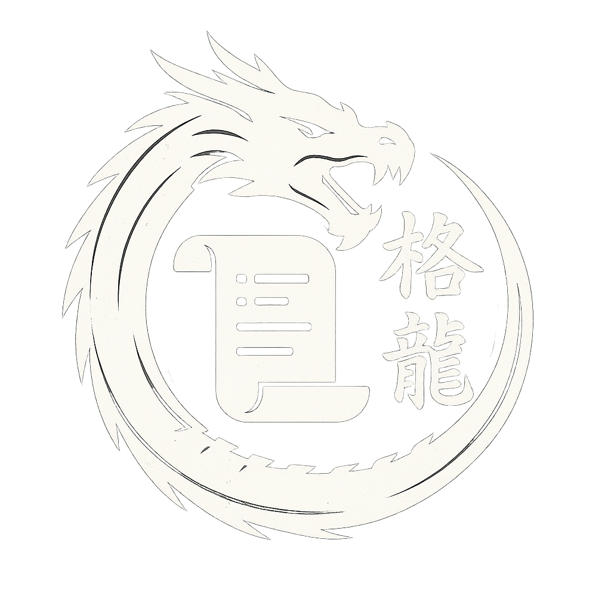
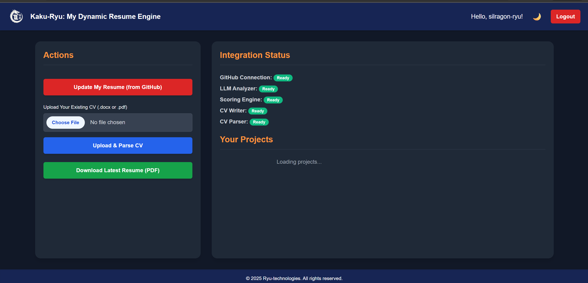
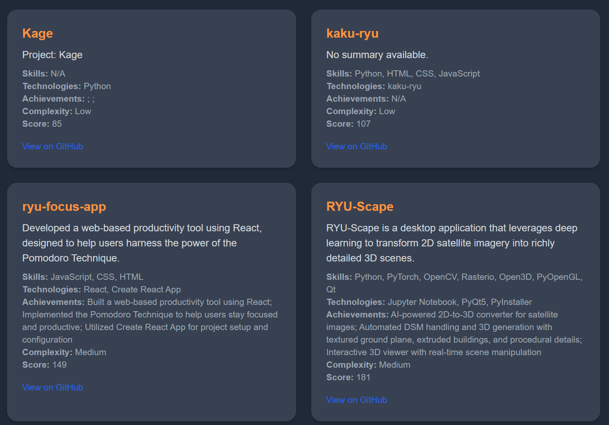
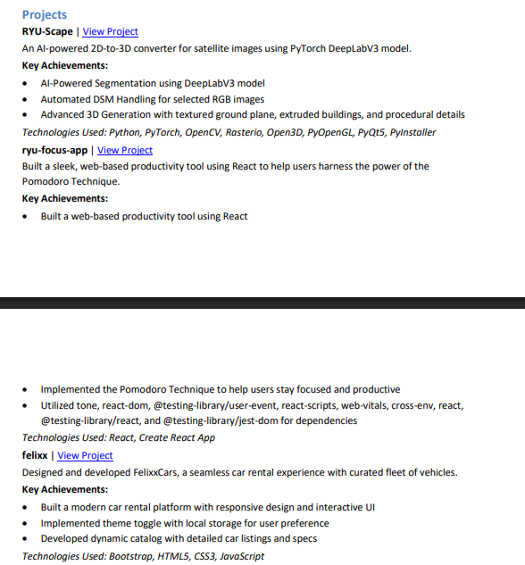

  

<h1 align="center">🐉 Kaku-Ryu: The Dynamic Resume Engine of Silragon Ryu</h1>

> *“Code is not the goal. It is the foundation. Kaku-Ryu helps you tell your story.”*

---

**Kaku-Ryu** is a dynamic, GitHub-integrated resume engine designed to automatically generate professional résumés (DOCX and PDF) based on real code and contributions.  
By analyzing your repositories using **Gemini 2.0 Flash**, it summarizes your work, identifies key technologies, skills, and achievements, and formats them into a job-ready CV.

---

## 📸 Screenshots

| Dashboard | Project Scoring | Resume Preview |
|----------|------------------|----------------|
|  |  |  |

---

## ⚙️ Features

- **GitHub Integration**  
  Automatically pulls data from your public and private repositories.

- **LLM-Powered Analysis**  
  Uses Google’s `Gemini 2.0 Flash` model to summarize project content and evaluate your skills.

- **Smart Scoring System**  
  Analyzes factors like project complexity, popularity, impact, and performance.

- **Resume Generation**  
  Creates professional DOCX and PDF résumés tailored to your actual work.

- **CV Parsing Support**  
  Parses existing DOCX/PDF files to extract relevant information.

- **Secure Authentication**  
  Supports GitHub OAuth and Email/Password login.

- **Responsive UI with Dark Mode**  
  Built with Tailwind CSS for a smooth experience across devices.

---

## 🧪 Tech Stack

**Backend:**
- `FastAPI`, `Python`, `Firebase Admin SDK`  
- `PyGithub`, `httpx`, `PyJWT`, `python-docx`, `docx2pdf`, `PyYAML`, `toml`, `dotenv`

**LLM Integration:**
- Gemini 2.0 Flash (via API) for project analysis

**Frontend:**
- `HTML5`, `Tailwind CSS`, `JavaScript`, `Jinja2`, `Firebase JS SDK`

---

## 🚀 Roadmap

- Customizable resume templates  
- Live GitHub analytics dashboard  
- Skill gap detection and job role matching  
- Encrypted token storage  
- Cloud deployment options

---

## 📄 License

**© 2025 Silragon Ryu – All Rights Reserved**  
This project is proprietary. Forking, cloning, or reusing the codebase is not permitted without written consent.

---

## 📫 Contact

- **GitHub**: [silragon-ryu](https://github.com/silragon-ryu)  
- **LinkedIn**: [Ahmed Ehab](https://www.linkedin.com/in/ahmed-ehab-992920344)  
- **Email**: silragonryu@gmail.com
